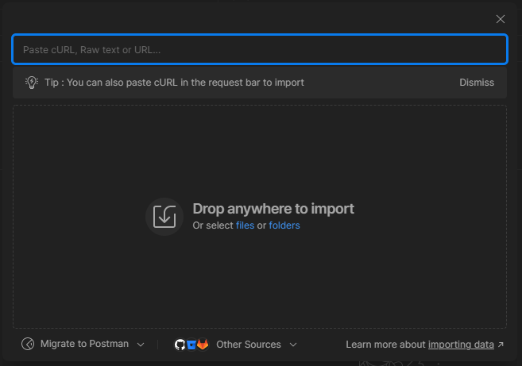

# Spring Data RESTの実装例

## 依存関係

このプロジェクトでは以下のライブラリを使用しています:

- Spring Boot Starter Data JPA: データベースへのアクセスとJPAの統合を容易にするスターター。
- Spring Boot Starter Data REST: Spring Data RESTを使用してRESTful APIを構築するためのスターター。
- Lombok: Javaのボイラープレートコードを自動生成および省略するライブラリ。
- H2 Database: インメモリデータベースとして使用されるJavaのDBMS。
- Spring Boot Starter Test: Spring Bootアプリケーションをテストするためのスターター。
- JUnit Platform Launcher: JUnit5のランチャーを提供するライブラリ。
- Springdoc OpenAPI Starter Web MVC UI: HTML形式でOpenAPI仕様を表示するためのライブラリ。

### Spring Data RESTによる自動エンドポイント生成について

Spring Data RESTは、Spring DataリポジトリのRESTfulエンドポイントを自動的に公開します。これにより、基本的なCRUD操作のコントローラーを手動で作成する必要がなくなり、RESTfulサービスの開発が大幅に簡素化されます。以下はその仕組みです。

1. **リポジトリの作成**: `CrudRepository`、`JpaRepository`、または他のSpring Dataリポジトリインターフェースを拡張してエンティティのリポジトリインターフェースを定義します。
   ```java
   import org.springframework.data.jpa.repository.JpaRepository;
   import org.springframework.data.rest.core.annotation.RepositoryRestResource;

   @RepositoryRestResource
   public interface UserRepository extends JpaRepository<User, Long> {
   }
   ```

2. **エンティティの定義**: データベース内のテーブルにマップされるエンティティクラスを作成します。
   ```java
   import javax.persistence.Entity;
   import javax.persistence.GeneratedValue;
   import javax.persistence.GenerationType;
   import javax.persistence.Id;

   @Entity
   public class User {
       @Id
       @GeneratedValue(strategy = GenerationType.IDENTITY)
       private Long id;
       private String name;

       // getters and setters
   }
   ```

3. **アプリケーションの実行**: 最小限の設定で、Spring Data RESTは`User`エンティティのエンドポイントを公開し、HTTPメソッドを使用してデータとやり取りすることができます。`http://localhost:8080/users`に対して`GET`、`POST`、`PUT`、`DELETE`リクエストを使用できます。

この自動化により、ボイラープレートコードが削減され、データ駆動型アプリケーションの迅速な開発が可能になります。例えば、`http://localhost:8080/users`にアクセスするとユーザーのリストが表示され、同じエンドポイントにポストすることで新しいユーザーを追加できます。

```properties
spring.data.rest.base-path=/api
```

この例では、すべてのSpring Data RESTリポジトリのベースパスが`/api`に変更されます。したがって、`User`エンティティのエンドポイントは`http://localhost:8080/api/users`でアクセス可能になります。

さらなるカスタマイズや高度な設定については、[公式のSpring Data RESTドキュメント](https://spring.io/projects/spring-data-rest)を参考にしてください。

## エンティティ概要

アプリケーションは主に`ユーザー`と`投稿`の2つのエンティティを中心に構成されています。これらのエンティティはデータモデルの中心であり、Spring Data RESTによって生成されるRESTful APIエンドポイントに直接影響を与えます。

### ユーザーエンティティ

`ユーザー`エンティティはユーザー情報をカプセル化し、`投稿`エンティティとの関係を確立します。これには次のものが含まれます。

- **フィールド**:
  - `id`: 各ユーザーの一意の識別子。
  - `firstName`: ユーザーの名。
  - `lastName`: ユーザーの姓。
- **リレーション**:
  - `posts`: ユーザーに関連付けられた投稿のコレクションで、1対多の関係を表します。

### プロジェクション

プロジェクションは、APIから返されるデータのビューをカスタマイズするために使用されます。例えば、`UserProjection`はパスワードフィールドを公開せずにユーザーのフルネームを取得する方法を提供します。

```java
package com.example.demo.projection;

import java.util.List;

import org.springframework.beans.factory.annotation.Value;
import org.springframework.data.rest.core.config.Projection;

import com.example.demo.entity.Posts;
import com.example.demo.entity.Users;

@Projection(name = "without-password", types = { Users.class })
public interface UserProjection {
    @Value("#{target.firstName} #{target.lastName}")
    public String getFullName();

    public List<Posts> getPosts();
}
```

このプロジェクションは、APIエンドポイントに`?projection=without-password`を追加することでアクセスできます。例えば、`http://localhost:8080/api/users?projection=without-password`。

### 投稿エンティティ

`投稿`エンティティはユーザーによって作成された個々の投稿を表します。これには次のものが含まれます。

- **フィールド**:
  - `id`: 各投稿の一意の識別子。
  - `title`: 投稿のタイトル。
  - `content`: 投稿の内容。
  - `published`: 投稿が公開されているかどうかを示すブール値。
- **リレーション**:
  - `user`: 投稿を作成したユーザーへの参照で、`ユーザー`エンティティへの多対1の関係を確立します。

これらのエンティティはアプリケーションのデータモデルのバックボーンを形成し、ユーザープロファイルおよび関連する投稿を管理するための直感的で機能的なRESTful APIを作成することを可能にします。

## リポジトリ概要

このアプリケーションは、`Users`と`Posts`エンティティのデータ永続化を管理するために、`UsersRepository`と`PostsRepository`の2つの主要なリポジトリを使用しています。これらのリポジトリは、Spring Data JPAから基本的なCRUD操作を継承しており、シームレスなデータアクセスと操作を可能にします。

### UsersRepository

`Users`エンティティの永続化を管理し、標準的なCRUD操作をサポートします。

### PostsRepository

`Posts`エンティティの永続化を扱い、CRUD操作に加えて投稿の公開ステータスによるフィルタリングメソッドを提供します。

これらのリポジトリは、Spring Data RESTによって生成されるRESTful APIの基盤となり、データアクセスと操作のプロセスを簡素化します。

## 起動

```bash
./gradlew bootRun
# または Windows
gradlew.bat bootRun
```

## データベースの確認

`http://localhost:8080/h2-console`


|              |                    |
| ------------ | ------------------ |
| Driver Class | org.h2.Driver      |
| JDBC URL     | jdbc:h2:mem:testdb |
| User Name    | sa                 |
| Password     |                    |

## APIの呼び出し

### 例

#### リクエスト
```bash
curl --location 'http://localhost:8080/users' \
--header 'Accept: application/hal+json'
```

#### レスポンス

```json
{
    "_embedded": {
        "users": [
            {
                "name": "James Smith",
                "_links": {
                    "self": {
                        "href": "http://localhost:8080/users/1"
                    },
                    "users": {
                        "href": "http://localhost:8080/users/1"
                    },
                    "posts": {
                        "href": "http://localhost:8080/users/1/posts"
                    }
                }
            },
            {
                "name": "Christopher Anderson",
                "_links": {
                    "self": {
                        "href": "http://localhost:8080/users/2"
                    },
                    "users": {
                        "href": "http://localhost:8080/users/2"
                    },
                    "posts": {
                        "href": "http://localhost:8080/users/2/posts"
                    }
                }
            }
        ]
    },
    "_links": {
        "self": {
            "href": "http://localhost:8080/users?page=0&size=20"
        },
        "profile": {
            "href": "http://localhost:8080/profile/users"
        }
    },
    "page": {
        "size": 20,
        "totalElements": 2,
        "totalPages": 1,
        "number": 0
    }
}
```

詳細については、`http://localhost:8080/swagger-ui/index.html`を参照してください。

### Postmanの使用

1. URLをコピー

`http://localhost:8080/v3/api-docs`

2. `インポート`をクリックしてURLを貼り付け



3. `インポート`をクリック

